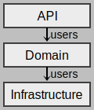

# 3. Architectural Patterns
Architectural patterns establish a relation between:
* **a context**
  - recurring, real-word situation
* **a problem**
  - the problem, **_appropriately generalized_**, that arises from the context
* **a solution**
  - a **successful architectural resolution** to the problem, **_appropriately abstracted_**.
  - determined and described by:
    - a set of element types
    - a set of interaction mechanisms or connectors
    - a topological layout of the components
    - a set of semantic constraints covering topology, element behaviour, and interaction mechanisms

# 3.1. Module Patterns
## Layer Pattern
TODO
### Context
* 
### Problem
* 
### Solution
* To achieve this separation of concerns, the layered pattern divides the software into units called layers.
* Each layer is a grouping of modules that offers a cohesive set of services.
  - e.g. no grouping of operating system modules along with web service modules.
* The **usage must be unidirectional**.
* Layers completely partition a set of software, **each partition exposed through a public interface**.

## Layer Pattern Solution
### Overview
* 
### Elements
* Layer, a kind of module.  
  The description of a layer should define what modules the layer contains.
### Relations
* 
### Constraints
  - When viewed using a Dependency Structure Matrix, with modules sorted by layer, from top to bottom, it should only show dependencies below the diagonal, otherwise it violates the unidiractional usage constraint.
---
### **Strengths**
* Promotes modifiability, reuse, portability.
  - e.g. module internals can be freely modified or interchanged, as long as its public interface remains the same.
* Achieves separation of concerns.
  - e.g. user interface module and database access module are completely seperate, and can be modified independently. 
* Manages complexity and facilitates communication of code structure to developers.
### **Weaknesses**
* The addition of layers adds up-front cost and complexity to a system.
* Layers contribute a performance penalty.
---

## Dependency Inversion: from Layer to Onion

## Aspect-Oriented Pattern
### Overview
hello <tiny> hello </tiny>
* 
### Elements
* 
### Relations
* 
### Constraints
* 
---
### **Strengths**
* 
### **Weaknesses**
* 
---