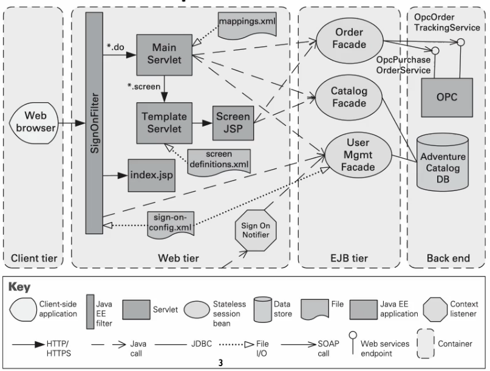

#### [Chapter 3](../../README.md)

# 3.3 Allocation Patterns

## Multi-tier Pattern

- ## Context
  - In a distributed system, there is often a need to distribute a system's infrastructure into distinct subsets.
- ## Problem
  - How can we split the system into a number of computationally independent execution structures, i.e. groups of software and hardware, connected by some communications media?
- ## Solution
  - The execution structures of many sstems organised as a set of logical groupings of components, each grouping termed a **tier**.
    - Not to be confused with _layers_ which group modules instead of structures.

- ## Overview
  - The execution structures of several systems are oganised as a set of **logical groupings of components**.
  - Each grouping is termed a tier.
  - Groupings can be based on execution environment, component type, runtime purpose, or other criteria.
- ## Elements
  - **Tier**, which is a logical grouping of software components.
  - If a tiers are formed on the basis of common computing platforms, those platforms are also elements of the pattern.
- ## Relations
  - **is-part-of**, to group components into tiers.
  - **communicates-with**, to show how tiers and the components they contain interact with each other.
  - **allocated-to**, in the case that tiers map to computing platforms.
- ## Constraints

  - A software component belongs to exactly one tier.
  - Connections hould only exist within the same tier or between adjacent tiers.
    - Not skipping over tiers allowed like in the Layer pattern, and not unidirectional.
  - Kinds of communication may also be constrained.
    - e.g. call-return in one direction but event-based in the other.

- ## **Strengths**
  - Facilitate ensuring security, and optimising performance & availability in tier-specific ways.
  - Enhance modifiability by reducing coupling, as computationally independent subgroups need to agree on protocols for interaction.
- ## **Weaknesses**
  - Substantial upfront cost & complexity.
    - As a consequence of containerisation and distributed communication.
