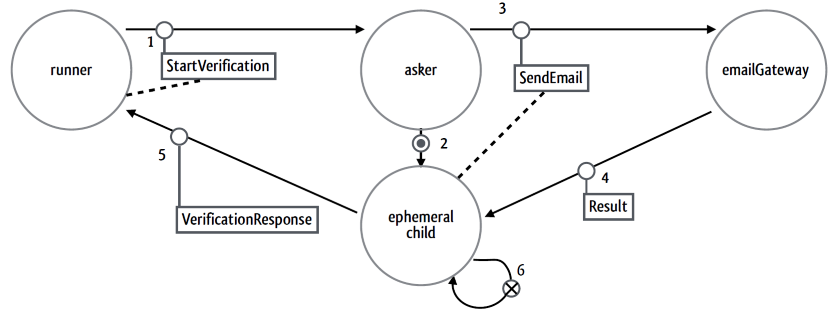
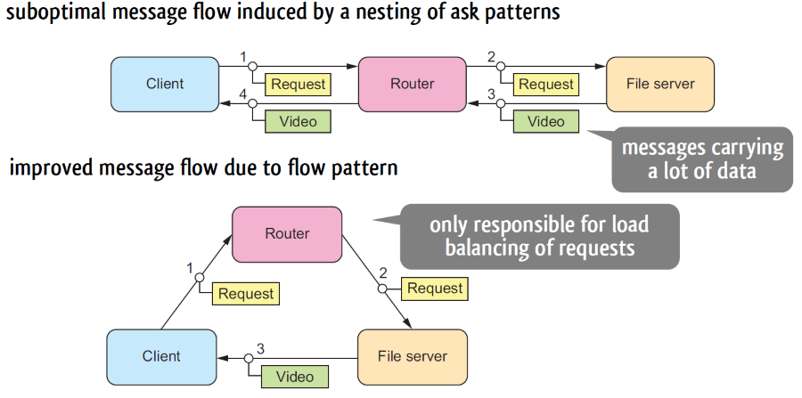
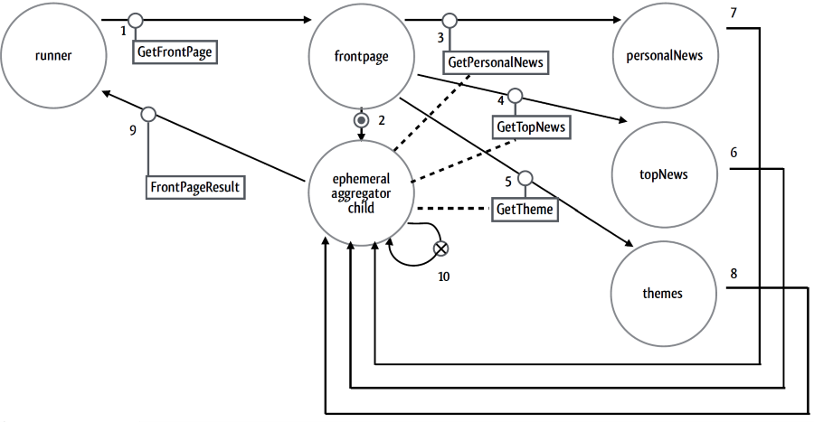
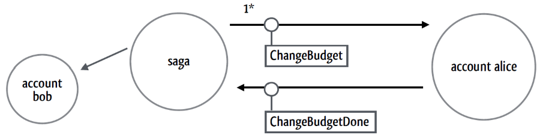
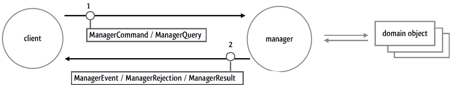
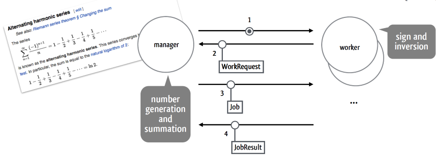
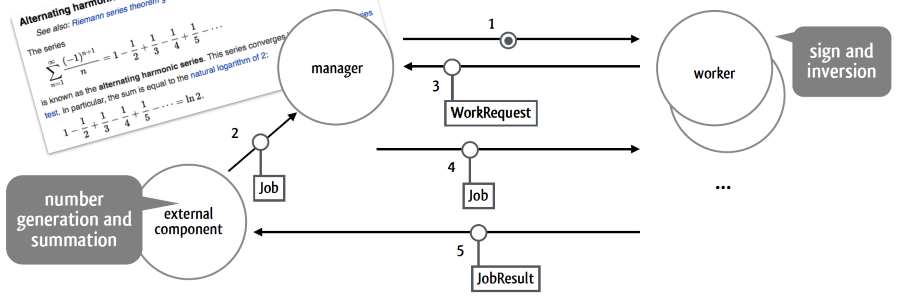

#### [Software Architectures](../../../../README.md)

# 4\. Actor- Based Design Patterns for Micro-Service Architectures

---

# 4.1 Messaging Patterns

## Request-Response Pattern

> _Include a return address in the message to receive a response._

### Applicability

- Requester already knows the destination address of Responder.
- Addresses can be transported to the Responder in a location-transparent manner; the address of the Requestor is still valid and usable after being transported.

### Considerations

- Requester might need to give the Responder time to recover by backing off when it is overloaded orin a failed state (see Circuit Breaker Pattern).

## Ask Pattern

### Applicability

- A Request-Response cycle needs to be completed before continuing with the logic of the enclosing business transaction.
- Manually correlating responses with requests is cumbersome and error-prone, as it also requires cleaning up stale requests that have been processed or that have timed out.
- Having the requester handle incoming responses for requests pollutes its own protocol, exposing it to the possibility of responding to wrong messages.

## Forward Flow Pattern

> _Let the information and the messages flow directly toward their
> destination where possible._

### Applicability

- Optimize overall resource consumption or response-latency by **identifying shortcuts** in **message response** flow.
- Comes at the cost of **introducing coupling** between source and target services (between file server and client), as reply-to addresses need to be shared by the intermediary (router).

## Aggregator Pattern

> _Create an ephemeral component if multiple service responses are needed
> to compute the result for a service call._

### Applicability

- Multiple Request-Response cycles need to be completed.
- None of the requests depends on the responses of the others, several cycles can therefore be made in parallel

#### Example use case: creating a page using a builder[^1] , aggregating each component using actors retrieving data in parallel.

[^1]: design pattern that allows creating of complex structures before all constructor arguments are available

## Business Handshake Pattern (aka Reliable Delivery)

> _Include identifying and/or sequencing information in the message,
> and keep retrying until confirmation is received._

### Applicability

- Requests must be conveyed and processed reliably.
- Reliable execution of transactions across components (and hence consistency boundaries) requires:
  - Requester must **keep resending the request until a matching response is received**.
  - Requester must include identifying information with the request.
  - Recipient must use the identifying information to **prevent multiple executions of the same request**.
  - **The recipient must always respond**, even for retransmitted requests.
- Responses imply the successful processing of the request (hence pattern’s name).
- When requests must not be lost across machine failures, a persistent version of the pattern can be used.
  - However, using persistent storage can reduce the throughput between components.

#### A `saga` is a long-running transaction, represented here as an actor in its own right. The `saga`'s address can be used in place of a correlation identifier. It lasts until it gets terminated, notifying a _DeathWatch_ to notify involved parties of its completion. `watchWith` is a method of `ActorContext`.

# 4.2 State & Persistence Patterns

## Domain Object Pattern

> _Perform state changes only by applying events. Make them durable by storing events in a log._

### Applicability

- Disentangle business logic from communication protocols and state management.
  - Allows persistence of state.
- Prevent having to use asynchronous integration tests for the domain object.

#### as an alternative to implementing the domain object itself as an actor, have the actor mediate between the distributed communication protocol and the methods understood by the domain object

## Event-Sourcing Pattern

> _Perform state changes only by applying events. Make them durable by storing events in a log._

### Applicability

- Domain object needs to be persisted, across system failures and cluster shard-rebalancing.
  - Akka can be asked to spread nodes evenly across a cluster, but has to know how actors ought to persist.
- State changes for domain objects are managed by a shell component (i.e. manager actor).
- Durability of a domain object’s state history is practical and potentially interesting.
  - Workaround to speed up recovery for larger journals:
    - persist intermediate snapshots of the domain object's state together with the event sequence number they are based on. However, changes to the implementation details of the domain object might invalidate older snapshots!
    - state of a shopping cart may fluctuate, but the total number of associated events should not exceed hundreds
- Not applicable when it is desirable to delete events from the journal. Events are supposed to represent immutable facts.

### **Advantages**

- One single source of truth with all history
  - Event log can be replayed for historic debugging
  - Event log can be replayed for auditing and traceability
  - Event log can be replayed on failure
  - Event log can be replayed for replication
- Allows for (Smalltalk-like) memory image: durable in-memory state
- Avoids object-relational impedance mismatch
- Allows others to subscribe to state changes
- Mechanically simple: append-only storage (scalable)

### **Disadvantages**

- Unfamiliar model
- Often leads to eventual consistency
  - An eventually consistent system can return any value before it converges.
- **Versioning of events** (event schema changes)
  - Difficult to make changes when they conflict with persisted data.
- **Deletion of events** (e.g. for legal reasons: EU's GDPR, right to be forgotten)
  - There are workarounds, like replacing the deleted event with a hash that can't be reconstructed.

# 4.3 Flow Control Patterns

> _Have the consumer ask the producer for batches of data._

## Pull Pattern

### Applicability

- Prevent an arbitrarily fast producer from overwhelming a slow consumer by propagating back pressure from consumer to producer.
- Works well for scenarios with an elastic worker pool that processes incoming requests that are self-contained and that do not depend on local state maintained on each worker node.

### Pull Pattern: compared to up-front work division

- If manager distributed all jobs over the workers upfront
  - Work items would accumulate in the workers’ mailboxes, risking out-of-memory errors.
  - Even upfront distribution would result in uneven execution times, with some worker finishing later than others. CPU utilisation would be suboptimal.
- Pull pattern enables the system to adapt to the relative speed of producer and consumer

  - When the producer is faster than the consumer, the producer will run out of demand from the consumer. The system runs in “pull” mode, with the consumer pulling work items from the producer with each request it makes.
  - When the producer is slower than the consumer, the consumer will always have demand outstanding. The system runs in “push” mode, where the producer never waits for a work request from the consumer.
  - **Under changing load, the system automatically switches between both modes.**

  ## Managed Queue Pattern

  > _Manage an explicit input queue and react to its fill level._

### Applicability

- When the Pull pattern is applied across a chain of processing components, avoid “stuttering” by employing queues as message buffers during periods in which back pressure signals travel through the system.
- Managed queues are predominantly used at the boundaries of the messaging system, where it has to interact with components that do not participate in back pressure.
- Managed queues can also be used to monitor and steer performance of a messaging system.

### Advanteges

- **Makes back pressure explicit**:
- Back pressure corresponds to the fill level of the queue that is filled with external requests and emptied based on workers' demands!
- Queue is used as a smoothing buffer, rejecting additional requests when the queue is full. Ensures service responsiveness while placing an upper bound on the size of the work queue.
- Could also spin up additional workers when a high-water mark is reached, adapting the worker pool elastically to the current service usage.
- Could also monitor rate of change, taking sustained growth as a signal to enlarge the pool and sustained decrease as a signal to shrink again.

## Drop Pattern

> _“Dropping requests is preferable to failing uncontrollably._

### Applicability

- Prevent a system from crawling to an uncontrolled halt when a system overload exhausts resources. Protect responsiveness by including two overload reactions:
  - Degrade functionality by sending back an incomplete response (i.e., JobRejected).
  - Drop the requests to reduce load.
- Decrease the probability of enqueuing in the Managed Queue with growing queue size.

# 4.4 Fault Tolerance

## Circuit Breaker Pattern

> _Prevent cascading failures by preventing requests to external services that begin to fail._

### Applicability

- Deliberately break up the flow of requests from one component to the next when the recipient is overloaded or otherwise failing.
  - Give the recipient some breathing room to recover from possible load-induced failures.
  - Let the sender decide that requests should fail instead of wasting time waiting for negative replies.

## Fault Tolerance: infrastructure desiderata

### Support Component Compartmentalisation

- The infrastructure needs to provide a means to compartmentalise its components so faulty components are isolated from others and do not escalate to a total system crash.

### Support Suspension of Component Interactions

- When a component fails, you’d like all calls to the component to be suspended until the component is fixed or replaced, so that when it is, the new component can continue the work without dropping a beat.
- The call that was handled at the time of failure should also not disappear, it could be critical to your recovery, and further, it might contain information that’s critical to understanding why the component failed. You might want to retry the call when you’re sure that there was another reason for the fault.

### Provide Component Lifecycle Management

- A faulty component needs to be isolated, and if it can't recover, it should be terminated and removed from the system or re-initialized with a correct starting state. Some defined lifecycle will need to exist to start, restart, and terminate the component.

### Enable Separation of Concerns

- It would be great if the fault-recovery code could be separated from the normal processing code. Fault recovery is a cross-cutting concern in the normal flow. A clear separation between normal flow and recovery flow will simplify development and maintenance.

## Actor Supervision

- Akka implements supervision:
  - Supervisors wrap message processing behavior and catch exceptions.
  - Mailbox for crashed actors is suspended until the supervisor has decided what to do with.
    - They only decide on the fate of a crashed actor based on the cause of the crash!
  - Message processing behavior contains normal processing logic, no error handling or fault recovery logic.

## Fault Recovery Options for Supervisors

- **Restart**
  - The crashed actor must be re-created. It will continue processing messages after its restart.
  - Possible because the rest of the application communicates with the actor through its address, an ActorRef.
- **Resume**
  - The same actor instance should continue processing messages; the crash is ignored.
- **Stop**
  - The actor must be terminated. It will no longer take part in processing messages.:w
