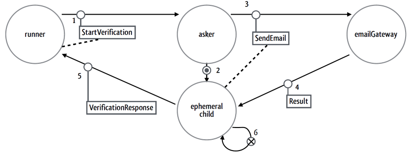
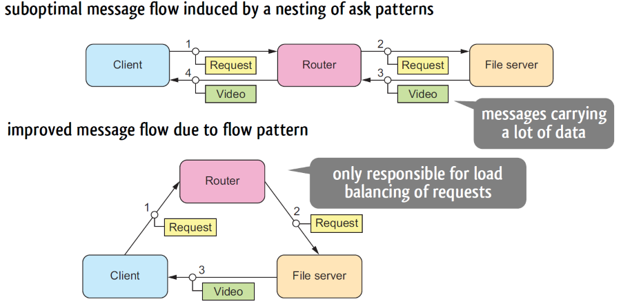
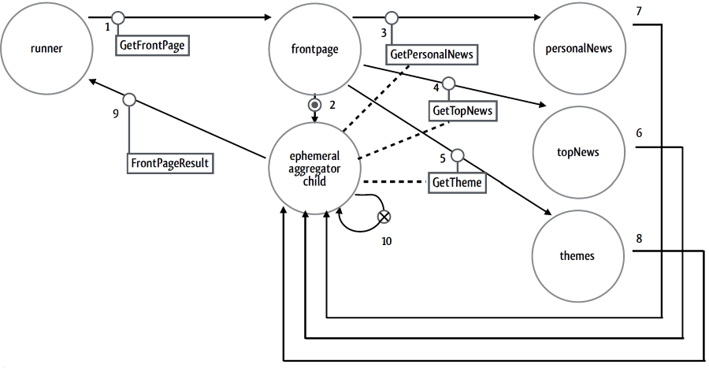
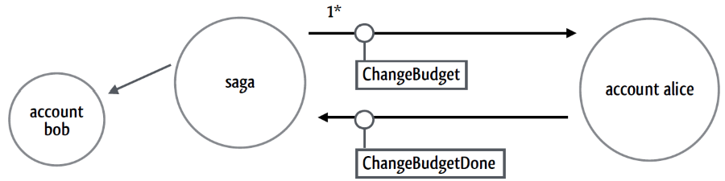
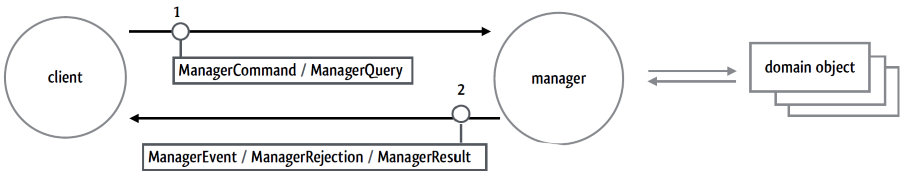

#### [Software Architectures](../../../../README.md)

# 4\. Actor- Based Design Patterns for Micro-Service Architectures

---

# 4.1 Messaging Patterns

## Request-Response Pattern

> _Include a return address in the message to receive a response._

### Applicability

- Requester already knows the destination address of Responder.
- Addresses can be transported to the Responder in a location-transparent manner; the address of the Requestor is still valid and usable after being transported.

### Considerations

- Requester might need to give the Responder time to recover by backing off when it is overloaded orin a failed state (see Circuit Breaker Pattern).

## Ask Pattern

### Applicability

- A Request-Response cycle needs to be completed before continuing with the logic of the enclosing business transaction.
- Manually correlating responses with requests is cumbersome and error-prone, as it also requires cleaning up stale requests that have been processed or that have timed out.
- Having the requester handle incoming responses for requests pollutes its own protocol, exposing it to the possibility of responding to wrong messages.

## Forward Flow Pattern

> _Let the information and the messages flow directly toward their
> destination where possible._

### Applicability

- Optimize overall resource consumption or response-latency by **identifying shortcuts** in **message response** flow.
- Comes at the cost of **introducing coupling** between source and target services (between file server and client), as reply-to addresses need to be shared by the intermediary (router).

## Aggregator Pattern

> _Create an ephemeral component if multiple service responses are needed
> to compute the result for a service call._

### Applicability

- Multiple Request-Response cycles need to be completed.
- None of the requests depends on the responses of the others, several cycles can therefore be made in parallel

#### Example use case: creating a page using a builder[^1] , aggregating each component using actors retrieving data in parallel.

[^1]: design pattern that allows creating of complex structures before all constructor arguments are available

## Business Handshake Pattern (aka Reliable Delivery)

> _Include identifying and/or sequencing information in the message,
> and keep retrying until confirmation is received._

### Applicability

- Requests must be conveyed and processed reliably.
- Reliable execution of transactions across components (and hence consistency boundaries) requires:
  - Requester must **keep resending the request until a matching response is received**.
  - Requester must include identifying information with the request.
  - Recipient must use the identifying information to **prevent multiple executions of the same request**.
  - **The recipient must always respond**, even for retransmitted requests.
- Responses imply the successful processing of the request (hence pattern’s name).
- When requests must not be lost across machine failures, a persistent version of the pattern can be used.
  - However, using persistent storage can reduce the throughput between components.

#### A `saga` is a long-running transaction, represented here as an actor in its own right. The `saga`'s address can be used in place of a correlation identifier. It lasts until it gets terminated, notifying a _DeathWatch_ to notify involved parties of its completion. `watchWith` is a method of `ActorContext`.

# 4.2 State & Persistence Patterns

## Domain Object Pattern

> _Perform state changes only by applying events. Make them durable by storing events in a log._

### Applicability

- Disentangle business logic from communication protocols and state management.
  - Allows persistence of state.
- Prevent having to use asynchronous integration tests for the domain object.

#### as an alternative to implementing the domain object itself as an actor, have the actor mediate between the distributed communication protocol and the methods understood by the domain object

## Event-Sourcing Pattern

> _Perform state changes only by applying events. Make them durable by storing events in a log._

### Applicability

- Domain object needs to be persisted, across system failures and cluster shard-rebalancing.
  - Akka can be asked to spread nodes evenly across a cluster, but has to know how actors ought to persist.
- State changes for domain objects are managed by a shell component (i.e. manager actor).
- Durability of a domain object’s state history is practical and potentially interesting.
  - Workaround to speed up recovery for larger journals:
    - persist intermediate snapshots of the domain object's state together with the event sequence number they are based on. However, changes to the implementation details of the domain object might invalidate older snapshots!
    - state of a shopping cart may fluctuate, but the total number of associated events should not exceed hundreds
- Not applicable when it is desirable to delete events from the
  journal. Events are supposed to represent immutable facts.

### **Advantages**

- One single source of truth with all history
  - Event log can be replayed for historic debugging
  - Event log can be replayed for auditing and traceability
  - Event log can be replayed on failure
  - Event log can be replayed for replication
- Allows for (Smalltalk-like) memory image: durable in-memory state
- Avoids object-relational impedance mismatch
- Allows others to subscribe to state changes
- Mechanically simple: append-only storage (scalable)

### **Disadvantages**

- Unfamiliar model
- Often leads to eventual consistency
- Versioning of events (event schema changes)
- Deletion of events (e.g. for legal reasons: EU's GDPR)
